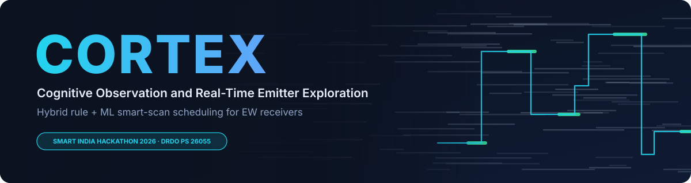
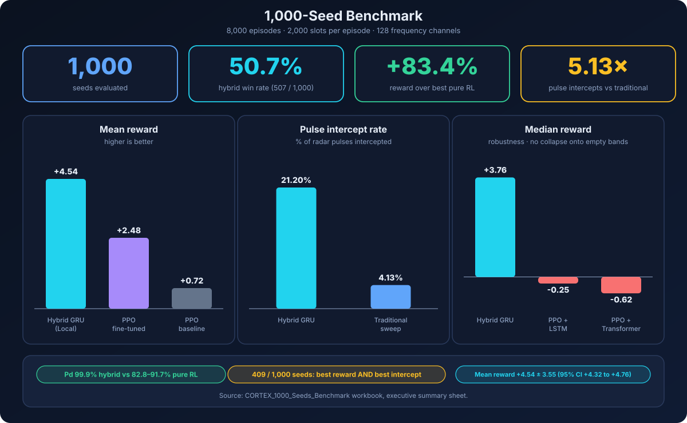
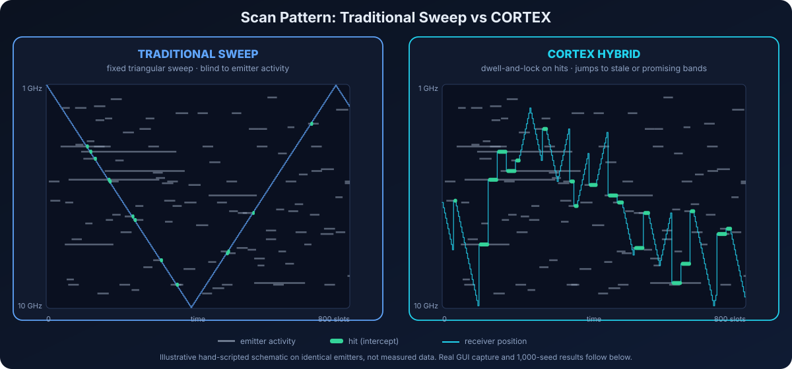
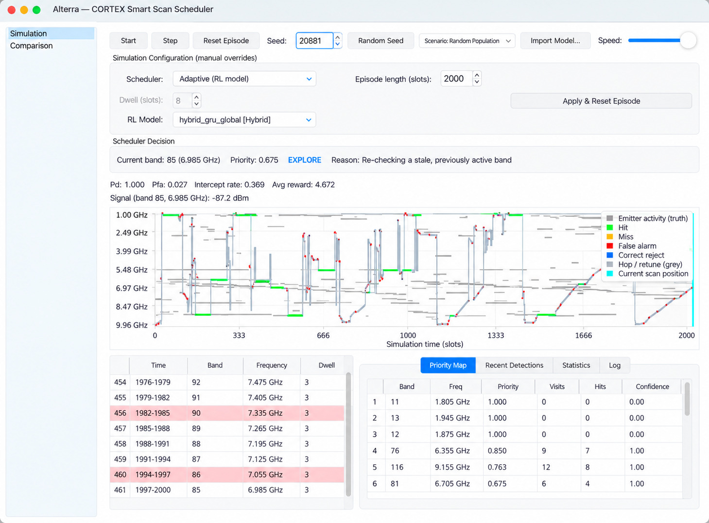
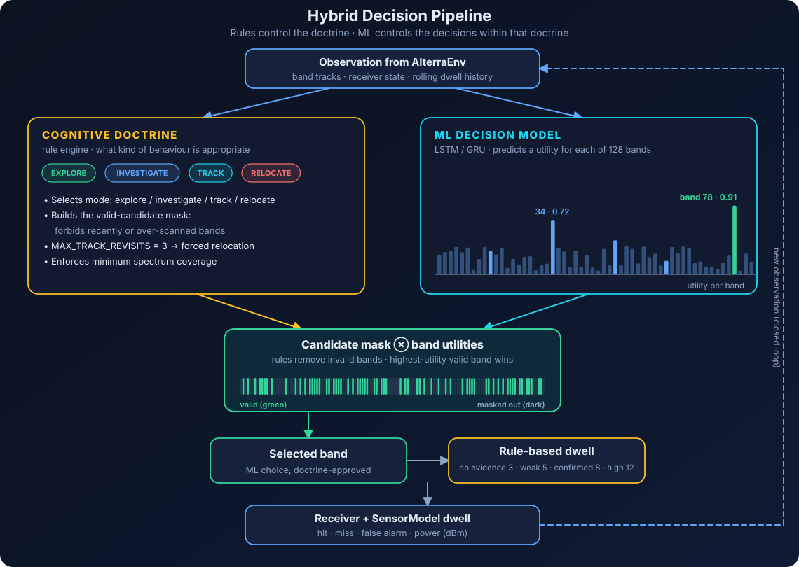
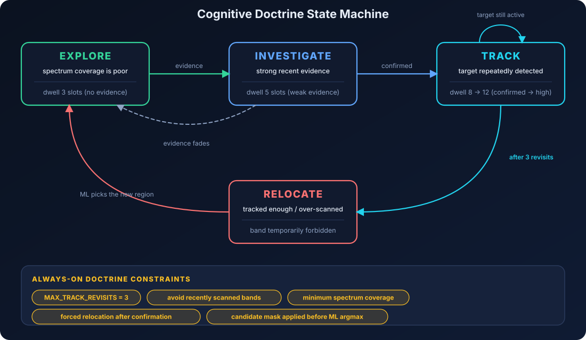
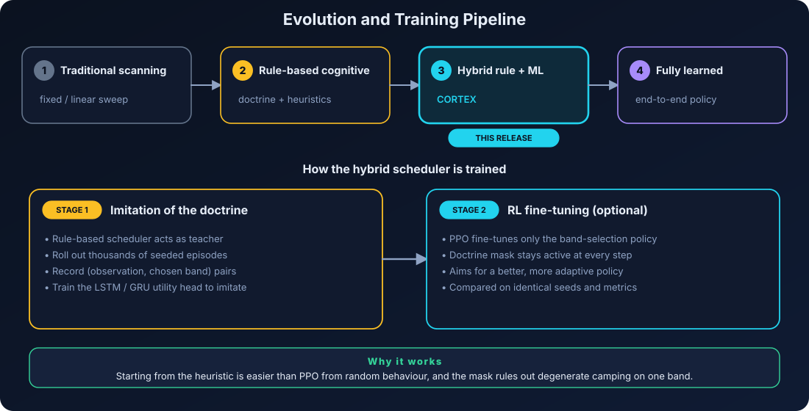
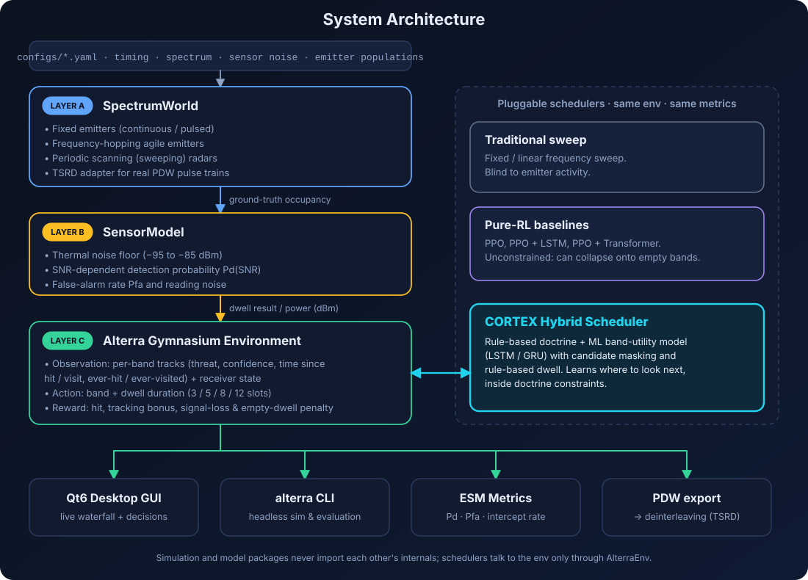

<p align="center">
  
</p>

<p align="center">
  
  
  
  
  
</p>

<p align="center">
  <b>Hybrid rule + machine-learning scan scheduling for electronic-warfare receivers.</b><br/>
  <i>Smart India Hackathon 2026 · DRDO Problem Statement 26055 · Smart Scan Strategy for Electronic Warfare Receiver</i>
</p>

<p align="center">
  <a href="#overview">Overview</a> ·
  <a href="#results">Results</a> ·
  <a href="#traditional-vs-cortex">Traditional vs CORTEX</a> ·
  <a href="#how-cortex-works">How it works</a> ·
  <a href="#desktop-gui">GUI</a> ·
  <a href="#quick-start">Quick start</a> ·
  <a href="#cli-reference">CLI</a>
</p>

---

## Overview

**CORTEX** (*Cognitive Observation and Real-Time Emitter Exploration*) is a smart-scan scheduler for wideband electronic-support (ES) receivers. The project, simulator and tooling live in this repository under the name **Alterra**; **CORTEX** is the scheduler and product built on top of it.

A scanning receiver can only listen to one narrow slice of the spectrum at a time. Traditional receivers sweep fixed or linear patterns, so they routinely miss agile, frequency-hopping and low-probability-of-intercept (LPI) emitters. Pure reinforcement learning (RL) is a tempting fix, but an unconstrained agent tends to over-exploit: it camps on one or two familiar bands and ignores the rest of the spectrum.

CORTEX takes a different route:

> **Rules control the doctrine. ML controls the decisions within that doctrine.**

- A **cognitive doctrine** (rule engine) decides *what kind of behaviour is appropriate*: explore, investigate, track or relocate. It also masks out invalid bands and caps how long the receiver may dwell on a target.
- An **ML model** (LSTM / GRU) learns *where to look next* by scoring the utility of each of the 128 frequency bands.
- **Rule-based dwell** escalates only as evidence accumulates.

The result keeps the reliability of a hand-built doctrine while making band selection adaptive and learned.

| | |
| :-- | :-- |
| **Spectrum** | 1 – 10 GHz split into 128 channels |
| **Time base** | Slot-based episodes (2,000 slots in the benchmark) |
| **Dwell options** | 3 / 5 / 8 / 12 slots |
| **Metrics** | Probability of detection (Pd), probability of false alarm (Pfa), intercept rate, average reward, signal strength (dBm) |
| **Interfaces** | Qt6 desktop GUI, `alterra` CLI, Gymnasium environment |

---

## Results

Evaluated on **1,000 random seeds** (8,000 episodes of 2,000 slots each) against a traditional sweep and several pure-RL agents.

<p align="center">
  
</p>

| Result | Value |
| :-- | :-- |
| Hybrid GRU win rate (Local + Global) | **50.7%** (507 of 1,000 seeds), ahead of all six other schedulers combined |
| Mean reward, Hybrid GRU (Local) | **+4.54 ± 3.55** (95% CI +4.32 to +4.76) |
| vs best fine-tuned PPO (+2.48) | **+83.4%** |
| vs baseline PPO (+0.72) | **+527%** |
| Radar pulse intercept rate | **21.20%** vs 4.13% for a traditional sweep (**5.13×**) |
| Probability of detection | **99.9%** hybrid vs 82.8 – 91.7% for pure RL (hopping jitter hurts RL) |
| Median reward (collapse check) | Hybrid GRU **+3.76**, PPO + LSTM −0.25, PPO + Transformer −0.62 |
| "Double crown" seeds | **409 / 1,000** (40.9%): best reward *and* best intercept rate on the same seed |

The negative medians for pure RL show the failure mode CORTEX is built to avoid: agents getting trapped on empty bands. Full per-seed data is in the benchmark workbook (`docs/benchmarks/CORTEX_1000_Seeds_Benchmark.xlsx`).

---

## Traditional vs CORTEX

<p align="center">
  
</p>

A traditional sweep walks the band at a fixed rate and only intercepts an emitter if it happens to be in the right place at the right moment. CORTEX sweeps locally while exploring, **locks on** when it gets a hit, **relocates** after a bounded number of revisits, and jumps to stale or promising bands instead of repeating itself.

The diagram above is an illustrative schematic. Below is a real capture of CORTEX running in the desktop GUI on seed 20881 with the `hybrid_gru_global` model:

<p align="center">
  
</p>

<!--
  Add your traditional-sweep GUI capture here for a side-by-side with the one above:
  
-->

In the waterfall, grey bars are ground-truth emitter activity, green marks are hits, red dots are false alarms, and the cyan line at the right edge is the current scan position. The long diagonals are exploration sweeps, the flat green runs are lock-and-track, and the vertical steps are relocations.

---

## How CORTEX works

### Hybrid decision pipeline

<p align="center">
  
</p>

1. The environment produces an **observation**: per-band track state, receiver state and a rolling dwell history.
2. The **doctrine** picks a behaviour mode and builds a **candidate mask** of valid bands.
3. The **ML model** outputs a **utility for every band** (128 values).
4. The mask is applied to the utilities and the **highest-utility valid band** is selected.
5. **Rules choose the dwell** from the strength of evidence on that band.
6. The receiver dwells, the sensor model reports hit / miss / power, and the loop repeats.

Because the network scores bands instead of emitting raw actions, the learning problem is far smaller than "pick one of 128 bands with no structure", and the doctrine can never be violated.

### Cognitive doctrine

<p align="center">
  
</p>

The rules never say *"scan band 63"*. They say *"exploit a confirmed target now, but do not stay there indefinitely"*.

```text
IF spectrum coverage is poor             → EXPLORE
IF there is strong recent evidence       → INVESTIGATE
IF a target is repeatedly detected       → TRACK
IF the target has been tracked enough    → RELOCATE
IF a band was just scanned repeatedly    → forbid it temporarily
```

### Who decides what

| Function | Owner |
| :-- | :-- |
| Explore vs exploit | Rules |
| Force relocation, `MAX_TRACK_REVISITS = 3` | Rules |
| Minimum spectrum coverage | Rules |
| Avoid recently scanned bands | Rules |
| Safety / action constraints | Rules |
| Dwell escalation (no evidence → 3, weak → 5, confirmed → 8, high confidence → 12) | Rules |
| Which band is most promising | **ML** |
| Adaptation to changing emitter patterns | **ML** |
| Long-term prioritisation | **ML** |

### Training pipeline

<p align="center">
  
</p>

1. **Imitation.** The rule-based scheduler is run over thousands of seeded episodes and its (observation, chosen band) pairs train the LSTM / GRU utility head.
2. **RL fine-tuning (optional).** PPO then fine-tunes the band-selection policy while the doctrine mask stays active.

All schedulers (traditional sweep, rule-based, hybrid, pure RL) run in the same environment and are scored with the same metrics, so comparisons are like-for-like.

<!-- TODO: add the exact train / evaluate commands for the hybrid models once the entry points are final. -->

### Why not just PPO?

Earlier versions used an unconstrained PPO (+ LSTM) scheduler. It is kept in the repo as a baseline, and it taught us two things:

- The policy collapsed onto a handful of fixed actions and stopped exploring. Part of this was a reward issue (re-confirming a known band paid full price) and part was an observation issue (a miss left the band's state unchanged, so "just checked, empty" looked identical to "never checked"). Both were fixed in the environment.
- Even after those fixes, pure RL can still get stuck on empty bands on many seeds, which is exactly what the negative median rewards in the [benchmark](#results) show.

Putting a doctrine around the learner removes that failure class instead of tuning around it.

---

## System architecture

<p align="center">
  
</p>

| Layer | Responsibility |
| :-- | :-- |
| **A: SpectrumWorld** | Ground-truth emitters: fixed (continuous / pulsed), frequency-hopping agile, periodic-scan radars, plus a TSRD adapter |
| **B: SensorModel** | Noise floor (−95 to −85 dBm), SNR-dependent Pd, false-alarm rate Pfa |
| **C: Gymnasium env** | Observation, action (band + dwell), reward, episode management |
| **Schedulers** | Traditional sweep, pure-RL baselines, CORTEX hybrid, all behind the same interface |
| **Outputs** | Qt6 GUI, `alterra` CLI, metrics, PDW export |

---

## Desktop GUI

A C++20 / Qt6 application with an embedded Python bridge. It shows what the scheduler is doing and why, in real time.

- **Waterfall spectrogram** of all 128 bands over time with emitter ground truth, hits, misses, false alarms, correct rejects, retunes and the live scan position.
- **Scheduler decision panel**: current band and frequency, priority, behaviour mode (for example `EXPLORE`) and a plain-language reason such as *"Re-checking a stale, previously active band"*.
- **Live metrics**: Pd, Pfa, intercept rate, average reward and measured signal strength in dBm.
- **Priority Map**: per-band priority, visits, hits and confidence, alongside tabs for recent detections, statistics and a log.
- **Dwell log** with time window, band, frequency and dwell for every decision.
- **Controls**: Start, Step, Reset Episode, seed + random seed, scenario selector, speed slider, episode length, scheduler type, RL model selector and **Import Model**.
- **Comparison page** (sidebar) for evaluating schedulers against each other.

### Build and run

```bash
# Configure and build with CMake (macOS / Homebrew example; adjust Qt path for your system)
cmake -B interfaces/qt_gui/build -S interfaces/qt_gui \
  -DCMAKE_PREFIX_PATH="/opt/homebrew/opt/qtbase;$(.venv/bin/python -m pybind11 --cmakedir)" \
  -DPython_EXECUTABLE="$(pwd)/.venv/bin/python"

cmake --build interfaces/qt_gui/build

# Launch
./interfaces/qt_gui/build/alterra_gui configs/default_config.yaml model/agents/checkpoints/best/best_model.zip
```

> **IDE tip:** CMake generates `compile_commands.json` at the project root. If your editor shows false errors, restart the `clangd` language server.

---

## Quick start

### 1. Environment setup

```bash
git clone https://github.com/Vishwesh-Bhilare/Alterra.git
cd Alterra

python -m venv .venv
source .venv/bin/activate

pip install -r requirements.txt
pip install -e .
```

### 2. Pipeline runner (`run.sh`)

```bash
./run.sh --gui              # launch the Qt6 desktop application
./run.sh                    # full pipeline demo: simulation suite + PDW export + dataset generation
./run.sh --sim              # fast simulation test with waterfall plot
./run.sh --tb               # TensorBoard dashboard (http://localhost:6006)
./run.sh --smoke-rl         # quick 1,000-step RL smoke test
./run.sh --train-rl 200000  # train the PPO baseline for 200,000 steps
./run.sh --help             # all options
```

### 3. PPO baseline training and evaluation

```bash
# Multi-core training (SubprocVecEnv)
python -m model.agents.train_ppo \
  --config configs/default_config.yaml \
  --timesteps 500000 \
  --n-envs 4 \
  --ent-coef 0.03 \
  --out model/agents/checkpoints/best/best_model.zip \
  --tensorboard-log model/agents/tb_logs

# Benchmark over 20 episodes
python -m model.agents.evaluate \
  --config configs/default_config.yaml \
  --model model/agents/checkpoints/best/best_model.zip \
  --episodes 20 \
  --steps-per-episode 200

# Inspect the action distribution of a checkpoint
python -m model.agents.inspect_policy \
  --config configs/default_config.yaml \
  --model model/agents/checkpoints/best/best_model.zip \
  --steps 200 \
  --episodes 3
```

---

## CLI reference

The headless `alterra` CLI covers simulation, environment verification and data export.

```bash
# Environment verification and metrics
alterra env check   --config configs/default_config.yaml          # Gymnasium check_env suite
alterra env preview --config configs/default_config.yaml --steps 50
alterra env metrics --config configs/default_config.yaml --episodes 10 --steps-per-episode 200
alterra env plot    --config configs/default_config.yaml --steps 200 --out episode_waterfall.png

# Emitters and scenarios
alterra emitters preview --config configs/default_config.yaml --episode-length 500
alterra scenario preview --config configs/default_config.yaml --scenario configs/scenarios/manual_example.yaml

# Pulse descriptor words (ToA, frequency, pulse width, power, DOA)
alterra pdw preview --config configs/default_config.yaml --episode-length 500 --limit 20
alterra pdw export  --config configs/default_config.yaml --episode-length 2000 --out pdws.jsonl
```

---

## Radar data and deinterleaving

CORTEX can be driven by the **Turing Synthetic Radar Dataset (TSRD)**: 88 emitter types and 78K+ pulse descriptor words (UTC time, RF frequency, pulse width, angle of arrival, amplitude), split into train / validation / test with increasing emitter counts.

```python
from simulation.utils.config_loader import load_config
from simulation.emitters.tsrd_adapter import build_tsrd_population

cfg = load_config("configs/default_config.yaml")
emitters = build_tsrd_population(
    file_path="/path/to/turing_synthetic_radar_data/scan/train_scan/config_0.h5",
    config=cfg,
    max_emitters=10,
)
```

The `model/deinterleaving` package trains a PDW encoder with a supervised-contrastive loss and clusters its embeddings with DBSCAN, reaching roughly 0.74 ARI / V-measure / AMI on TSRD.

---

## Repository layout

```text
Alterra/
├── simulation/            Core RF simulation engine
│   ├── emitters/            fixed, agile and periodic-scan emitters; TSRD adapter
│   ├── environment/         spectrum world, sensor model, receiver, Gymnasium env, PDW exporter
│   ├── metrics/             Pd, Pfa, intercept-rate tracking
│   └── utils/               config loaders, seeded RNG managers
├── model/
│   ├── agents/              schedulers, PPO training / evaluation / policy inspection, checkpoints
│   └── deinterleaving/      PDW encoder, datasets, losses
├── interfaces/
│   ├── cli/                 Click-based `alterra` CLI
│   └── qt_gui/              C++20 / Qt6 desktop GUI with Python bridge
├── configs/               YAML configs: timing, spectrum, sensor noise, emitter populations
├── training/              training pipelines
├── scripts/               helper scripts
├── tests/                 test suite
├── docs/                  design notes and diagrams (docs/assets)
└── run.sh                 end-to-end pipeline runner
```

`simulation/` and `model/` never import each other's internals; schedulers only depend on the `AlterraEnv` Gymnasium interface.

---

## License and attribution

Developed for **Smart India Hackathon 2026** under **DRDO Problem Statement 26055: Smart Scan Strategy for Electronic Warfare Receiver**.

Released under the [MIT License](LICENSE).
