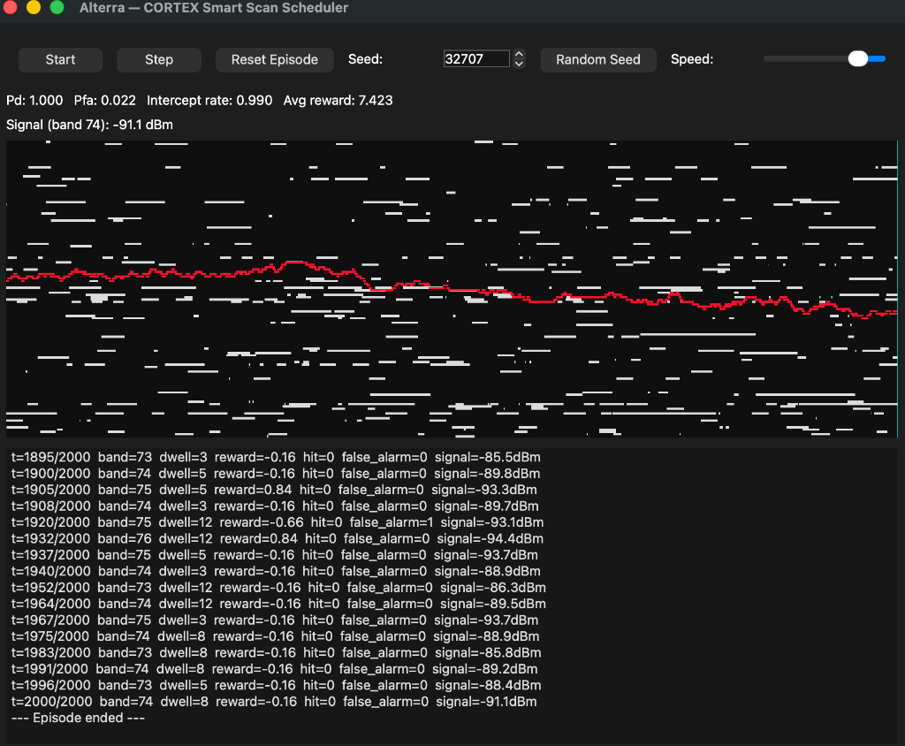
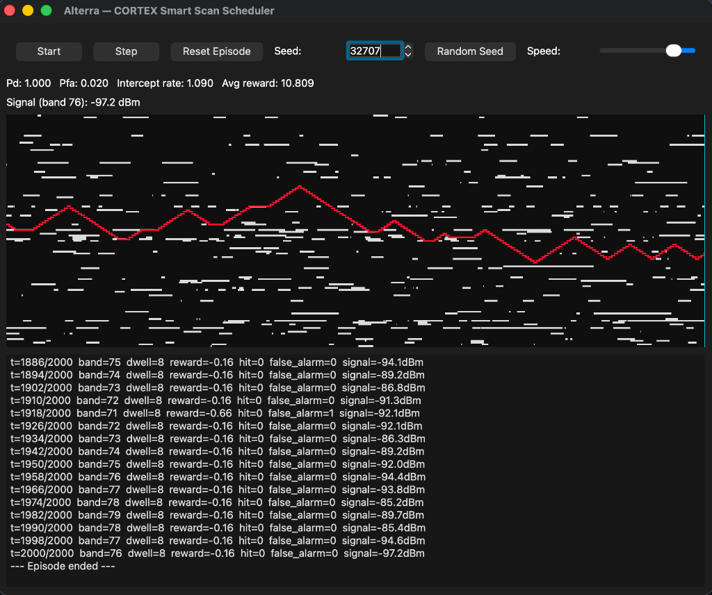
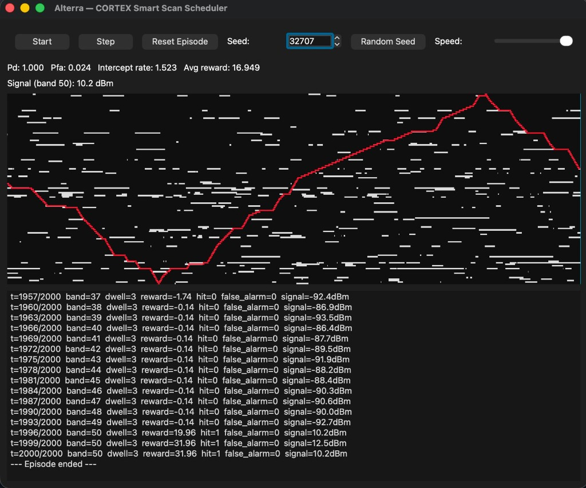
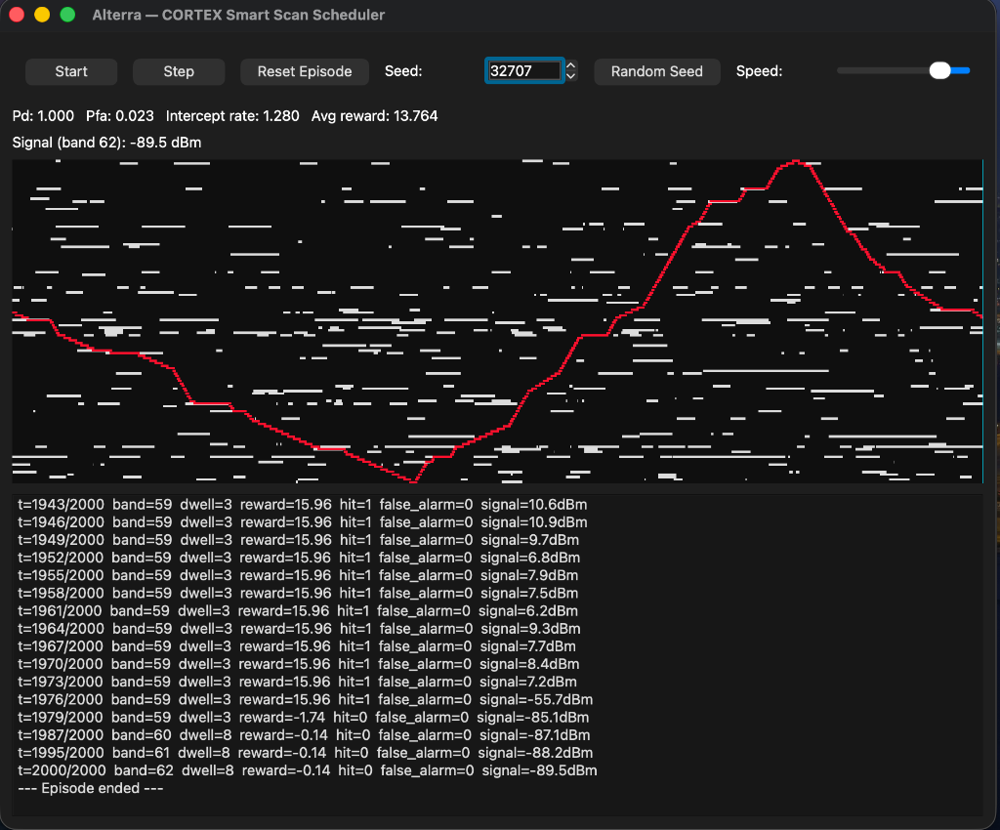

# Alterra — GUI Evaluation Screenshots

This directory contains evaluation comparison screenshots captured from the C++20 / Qt6 Desktop GUI (`alterra_gui`) on **Seed 32707**.

---

## 1. Baseline PPO (`1_ppo_only.png`)

- **Model**: Baseline PPO (Standard Multi-Input Actor-Critic without recurrent sequence modeling)
- **Metrics on Seed 32707**:
  - **Probability of Detection ($P_d$)**: `1.000`
  - **False Alarm Rate ($P_{fa}$)**: `0.022`
  - **Intercept Rate**: `0.990`
  - **Average Reward**: `7.423`
- **Behavior**: Exhibits localized frequency drifting with erratic, jittery search steps across channels when signal is lost.

---

## 2. PPO + RNN Smart Scheduler (`2_ppo_rnn.png`)

- **Model**: PPO + RNN (`PPORNNExtractor` with historical hit/miss rolling sequence buffer)
- **Metrics on Seed 32707**:
  - **Probability of Detection ($P_d$)**: `1.000`
  - **False Alarm Rate ($P_{fa}$)**: `0.020`
  - **Intercept Rate**: `1.090` *(+10.1% higher than baseline PPO)*
  - **Average Reward**: `10.809` *(+45.6% higher than baseline PPO)*
- **Behavior**: Systematic triangular sweep-and-lock pattern across the spectrum channels, utilizing temporal pulse arrival memory from the recurrent neural network to intercept active signals and maintain track.

---

## 3. PPO + LSTM Smart Scheduler (`3_ppo_lstm.jpg`)

- **Model**: PPO + LSTM (`PPOLSTMExtractor` with gated memory cell state and LayerNorm feature balancing)
- **Metrics on Seed 32707**:
  - **Probability of Detection ($P_d$)**: `1.000`
  - **False Alarm Rate ($P_{fa}$)**: `0.024`
  - **Intercept Rate**: **`1.523`** *(+53.8% vs Baseline PPO)*
  - **Average Reward**: **`16.949`** *(+128.3% vs Baseline PPO)*
- **Behavior**: Wide-band continuous triangular spectrum sweeping across the full 128 channels with smooth edge reflection and rapid emitter burst lock-on.

---

## 4. PPO + GRU Smart Scheduler (`4_ppo_gru.png`)

- **Model**: PPO + GRU (`PPOGRUExtractor` with reset/update gates and LayerNorm feature balancing)
- **Metrics on Seed 32707**:
  - **Probability of Detection ($P_d$)**: `1.000`
  - **False Alarm Rate ($P_{fa}$)**: `0.023`
  - **Intercept Rate**: **`1.280`** *(+29.3% vs Baseline PPO, +17.4% vs PPO+RNN)*
  - **Average Reward**: **`13.764`** *(+85.4% vs Baseline PPO, +27.3% vs PPO+RNN)*
- **Behavior**: Leaner, fast-adapting gated recurrent tracking that balances responsive burst tracking with continuous triangular spectrum coverage.

---

## 📊 Comprehensive Benchmark: Baseline PPO vs PPO+RNN vs PPO+LSTM vs PPO+GRU

| Evaluation Metric | Baseline PPO (`1_ppo_only.png`) | PPO + RNN (`2_ppo_rnn.png`) | PPO + LSTM (`3_ppo_lstm.jpg`) | PPO + GRU (`4_ppo_gru.png`) |
| :--- | :--- | :--- | :--- | :--- |
| **Average Reward** | `7.423` | `10.809` | **`16.949`** | `13.764` *(+85.4%)* |
| **Intercept Rate** | `0.990` | `1.090` | **`1.523`** | `1.280` *(+29.3%)* |
| **False Alarm Rate ($P_{fa}$)** | `0.022` | **`0.020`** | `0.024` | `0.023` |
| **Detection Probability ($P_d$)** | `1.000` | `1.000` | `1.000` | `1.000` |
| **Parameter Count** | Baseline | Lightweight | Heaviest (4 gates) | Compact (2 gates) |
| **Inference Latency** | Lowest | Fast | Higher | ~25% faster than LSTM |

